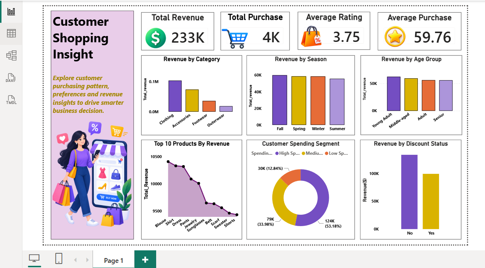

# 🛍️ Customer Shopping Behavior Analysis

## 📌 Project Overview

This project analyzes customer shopping behavior to identify purchasing patterns, revenue trends, product performance, customer spending segments, and other business insights.

The analysis was performed using **Python, SQL, and Power BI** to transform raw customer transaction data into meaningful business insights.

---

## 🎯 Project Objectives

The main objectives of this project are:

- Analyze overall customer purchasing behavior
- Identify high-revenue product categories
- Analyze revenue across different seasons
- Compare customer spending patterns
- Identify top-performing products
- Analyze customer behavior by age group and gender
- Understand the impact of discounts on revenue
- Create an interactive Power BI dashboard
- Provide business insights that can support decision-making

---

## 🛠️ Tools & Technologies

- **Python**
- **Pandas**
- **SQL / MySQL**
- **Power BI**
- **DAX**
- **Data Visualization**

---

## 📊 Dataset

The dataset contains **3,900 customer purchase records** and includes information such as:

- Customer ID
- Age
- Gender
- Item Purchased
- Category
- Purchase Amount
- Location
- Size
- Color
- Season
- Review Rating
- Subscription Status
- Shipping Type
- Discount Applied
- Promo Code Used
- Previous Purchases
- Payment Method
- Frequency of Purchases

---

## 🐍 Python / Pandas Analysis

Python and Pandas were used for:

- Data loading and inspection
- Data cleaning
- Handling missing values
- Exploratory data analysis
- Customer segmentation
- Aggregation and statistical analysis
- Identifying purchasing patterns

The complete Python analysis is available in:

**`customer_shopping_analysis.ipynb`**

---

## 🗄️ SQL Analysis

SQL was used to answer business-related questions such as:

- What is the total number of customers?
- What is the average purchase amount?
- What is the total revenue?
- Which product categories generate the highest revenue?
- Which products generate the highest revenue?
- How does revenue vary across customer groups?
- How do discounts affect revenue?
- Which customer segments contribute the most revenue?

The complete SQL queries are available in:

**`customer_shopping_analysis.sql`**

---

## 📈 Power BI Dashboard

The Power BI dashboard provides a visual summary of the customer shopping analysis.

### Key Dashboard Metrics

- **Total Revenue:** $233K
- **Total Purchases:** 4K
- **Average Rating:** 3.75
- **Average Purchase:** $59.76

### Dashboard Analysis Includes

- Revenue by Product Category
- Revenue by Season
- Revenue by Age Group
- Top 10 Products by Revenue
- Customer Spending Segments
- Revenue by Discount Status

### Dashboard Preview

---

## 🔍 Key Insights

### 💰 Revenue by Category

**Clothing** generated the highest revenue among all product categories, followed by Accessories, Footwear, and Outerwear.

### 🛍️ Top Product

**Blouse** was the highest-revenue product with approximately **$10,410** in revenue.

### 👥 Customer Spending

The **High Spender** segment contributed the largest share of revenue compared with Medium and Low Spenders.

### 🍂 Seasonal Performance

**Fall** generated the highest seasonal revenue, while Summer generated the lowest among the four seasons.

### 🎟️ Discount Analysis

Customers without discounts generated higher total revenue than customers who received discounts.

### 👤 Age Group

The **Young Adult** customer group generated the highest revenue among the analyzed age groups.

---

## 💡 Business Recommendations

Based on the analysis:

- Focus marketing efforts on high-spending customers.
- Promote high-performing products such as Blouse, Shirt, and Dress.
- Use seasonal campaigns to increase sales during lower-performing seasons.
- Analyze discount strategies carefully because higher discount usage did not result in higher total revenue.
- Develop targeted marketing campaigns for different customer age groups.
- Use customer purchasing behavior to create personalized promotions.

---

## 📁 Project Files

| File | Description |
|------|-------------|
| `customer_shopping_analysis.ipynb` | Python and Pandas analysis |
| `customer_shopping_analysis.sql` | MySQL business analysis queries |
| `customer_shopping_dashboard.png` | Power BI dashboard preview |
| `customer_shopping_dashboard.pbix` | Power BI dashboard file |
| `README.md` | Project documentation |

---

## 👩‍💻 Author

**Komal Verma**

Data Analyst | Python | SQL | Power BI | Excel

